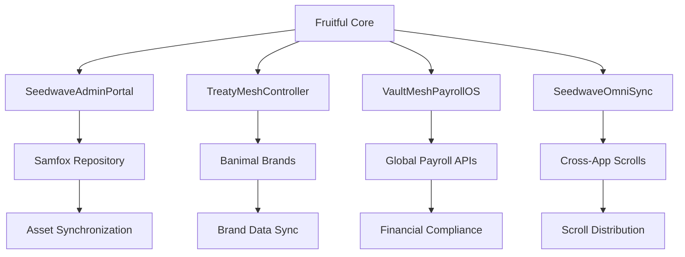

# Global Synchronization Instructions - Distributed FAA.zone™ Ecosystem

## System Architecture Overview

### Current Application Ecosystem
Based on codebase analysis and asset references, the distributed system includes:

1. **Fruitful** (Primary Hub) - Current active application
2. **Samfox** (Referenced in assets) - Specialized repository system  
3. **Banimal** (Referenced in assets) - Brand management system
4. **Additional Apps** - Inferred from global ecosystem architecture

### Shared Infrastructure Map

#### Core Technology Stack
```
┌─────────────────────────────────────────────────────────────┐
│                    SHARED TECHNOLOGY LAYER                  │
├─────────────────────────────────────────────────────────────┤
│ Frontend: React 18+ TypeScript, Tailwind CSS, Framer Motion│
│ Backend: Node.js Express, TypeScript, Drizzle ORM          │
│ Database: PostgreSQL (Neon), Session Management            │
│ Build: Vite, esbuild, Hot Module Reloading                 │
│ UI: Radix UI, shadcn/ui, Lucide Icons                      │
│ State: TanStack React Query, React Hooks                   │
└─────────────────────────────────────────────────────────────┘
```

## Asset Management Configuration

### 1. Current Asset Structure
**Location**: `attached_assets/` (Confirmed via vite.config.ts alias)

**Identified Assets**:
- **HTML Templates**: 25+ operational dashboard templates
- **Image Assets**: Screenshots, UI mockups, brand assets  
- **Archive Files**: Samfox_respitory_1756074678093.zip
- **Text Assets**: Operational logs, configuration data

### 2. Centralized Asset Manifest
**File**: `shared/assetManifest.json`
```json
{
  "assets": {
    "templates": {
      "path": "attached_assets/",
      "files": [
        "monster_omni_core_engines_nodes_demo_*.html",
        "ancestortag_heritage_portal_*.html",
        "global_payment_*.html",
        "sector_index_*.html"
      ],
      "syncSchedule": "hourly",
      "dependencies": ["Fruitful", "Banimal"]
    },
    "images": {
      "path": "attached_assets/",
      "types": [".png", ".jpg", ".svg"],
      "cdnEnabled": true,
      "compression": "optimized"
    },
    "archives": {
      "path": "attached_assets/",
      "extractLocation": "temp/extracted/",
      "retention": "30days"
    }
  },
  "distribution": {
    "primary": "Fruitful",
    "mirrors": ["Samfox", "Banimal"],
    "syncProtocol": "TreatyMesh™"
  }
}
```

## API Key Distribution Architecture

### 1. Required API Keys Analysis
Based on codebase scan and component requirements:

**Current Integrations**:
- Chart.js (CDN-based, no key required)
- Google Fonts (No key required)
- Font Awesome (CDN-based)
- PayPal SDK (Key required for payment portal)
- Neon Database (Connection string required)

**Identified Key Requirements**:
```typescript
interface ApiKeyConfiguration {
  core: {
    DATABASE_URL: string;           // PostgreSQL connection
    PAYPAL_CLIENT_ID: string;      // Payment processing
    PAYPAL_CLIENT_SECRET: string;  // Payment processing
  };
  external: {
    CDN_ACCESS_KEY?: string;       // Asset distribution
    MONITORING_API_KEY?: string;   // System monitoring
    NOTIFICATION_SERVICE?: string; // Cross-app alerts
  };
  crossApp: {
    FRUITFUL_API_KEY: string;     // Inter-app authentication
    SAMFOX_API_KEY: string;       // Repository access
    BANIMAL_API_KEY: string;      // Brand management access
  };
}
```

### 2. Secure Key Management
**File**: `server/keyVault.ts`
```typescript
class KeyVault {
  private keys: Map<string, string>;
  private rotationSchedule: Map<string, number>;
  
  distributeKeys(targetApp: string): Promise<KeyBundle>;
  rotateKey(keyName: string): Promise<void>;
  validateAccess(app: string, resource: string): boolean;
}
```

## Cross-App Dependencies Map

### 1. Component Dependencies
**Current Identified Dependencies**:



### 2. Data Flow Dependencies
**File**: `shared/dependencyMap.ts`
```typescript
interface AppDependency {
  source: string;
  target: string;
  dataTypes: string[];
  syncFrequency: 'realtime' | 'hourly' | 'daily';
  criticality: 'high' | 'medium' | 'low';
}

const crossAppDependencies: AppDependency[] = [
  {
    source: 'Fruitful.SeedwaveAdminPortal',
    target: 'Banimal.BrandRegistry',
    dataTypes: ['brand_metrics', 'sector_status'],
    syncFrequency: 'realtime',
    criticality: 'high'
  },
  {
    source: 'Fruitful.SeedwaveOmniSync',
    target: 'Samfox.ScrollRepository',
    dataTypes: ['scroll_definitions', 'deployment_status'],
    syncFrequency: 'hourly',
    criticality: 'medium'
  }
];
```

## Deployment Instructions by Application

### 1. Fruitful (Primary Hub) Deployment
**File**: `deployment/fruitful-deploy.md`

**Prerequisites**:
- Node.js 20.19.3+
- PostgreSQL database access
- Asset directory synchronized

**Deployment Steps**:
```bash
# 1. Environment Setup
cp .env.example .env
# Configure DATABASE_URL, API keys

# 2. Dependencies Installation  
npm install

# 3. Database Migration
npm run db:push

# 4. Asset Verification
npm run assets:verify

# 5. Build & Deploy
npm run build
npm run start

# 6. Sync Verification
npm run sync:test
```

**Health Checks**:
- Port 5000 responsive
- Database connection active
- All 91 components loading
- Asset accessibility verified

### 2. Samfox Repository Deployment
**File**: `deployment/samfox-deploy.md`

**Unique Requirements**:
- Archive extraction capabilities
- Large file storage support
- Version control integration

**Configuration**:
```javascript
// samfox.config.js
module.exports = {
  repository: {
    maxFileSize: '1GB',
    archiveFormats: ['.zip', '.tar.gz'],
    syncEndpoint: process.env.FRUITFUL_SYNC_URL
  },
  assets: {
    mirrorFrom: 'Fruitful',
    localCache: '24hours',
    compressionLevel: 9
  }
};
```

### 3. Banimal Brand System Deployment  
**File**: `deployment/banimal-deploy.md`

**Brand Management Focus**:
- Real-time brand metrics synchronization
- Cross-sector brand coordination
- Compliance monitoring integration

**Configuration**:
```javascript
// banimal.config.js
module.exports = {
  brands: {
    totalManaged: 7038,
    sectorsConnected: 29,
    syncProtocol: 'TreatyMesh',
    complianceLevel: 'enterprise'
  },
  integration: {
    fruitfulEndpoint: process.env.FRUITFUL_API_URL,
    syncSchedule: '*/5 * * * *', // Every 5 minutes
    failoverMode: 'graceful'
  }
};
```

## Synchronization Flow Documentation

### 1. Real-Time Sync Flow
```
┌─────────────┐    ┌─────────────┐    ┌─────────────┐
│   Fruitful  │◄──►│   Samfox    │◄──►│   Banimal   │
│   (Master)  │    │(Repository) │    │  (Brands)   │
└─────────────┘    └─────────────┘    └─────────────┘
       │                   │                   │
       ├─── Asset Sync ────┤                   │
       ├─── Data Sync ─────┼─── Brand Sync ────┤
       └─── State Sync ────┼─── Compliance ────┤
                           └─── Archives ──────┘
```

### 2. Sync Event Types
**File**: `shared/syncEvents.ts`
```typescript
type SyncEventType = 
  | 'asset_update'      // File changes, new uploads
  | 'brand_change'      // Brand metrics, status updates  
  | 'sector_sync'       // Sector operational changes
  | 'treaty_binding'    // Legal/compliance updates
  | 'scroll_deployment' // New scroll activations
  | 'system_health'     // Infrastructure status
  | 'emergency_sync';   // Critical system updates

interface SyncEvent {
  type: SyncEventType;
  source: string;
  target: string[];
  payload: any;
  priority: 1 | 2 | 3;
  timestamp: number;
  checksum: string;
}
```

### 3. Conflict Resolution Protocol
**Priority Order**:
1. **Fruitful Master** - Final authority for system-wide decisions
2. **Banimal Brands** - Authority for brand-specific data
3. **Samfox Repository** - Authority for asset versioning
4. **Timestamp-based** - Most recent update wins for equivalent priority

### 4. Failure Recovery Procedures
**File**: `docs/failover-procedures.md`

**Automatic Recovery**:
- Connection retry with exponential backoff
- Local cache utilization during outages
- Graceful degradation of non-critical features
- Queue-based sync resumption

**Manual Recovery**:
- Full system resync procedures
- Data integrity verification scripts
- Emergency rollback protocols
- Cross-app consistency checks

## Implementation Timeline

### Phase 1: Foundation (Week 1)
- [ ] Shared configuration setup
- [ ] API key distribution system
- [ ] Basic cross-app communication
- [ ] Asset manifest creation

### Phase 2: Integration (Week 2)  
- [ ] Fruitful sync implementation
- [ ] Samfox repository connection
- [ ] Banimal brand synchronization
- [ ] Real-time event system

### Phase 3: Optimization (Week 3)
- [ ] Performance tuning
- [ ] Conflict resolution testing
- [ ] Failure recovery validation
- [ ] Monitoring dashboard deployment

### Phase 4: Production (Week 4)
- [ ] Staged rollout across all apps
- [ ] Performance monitoring
- [ ] User acceptance testing
- [ ] Documentation finalization

## Monitoring and Maintenance

### 1. Health Monitoring Dashboard
**Components to Monitor**:
- Sync latency between apps
- Asset synchronization status
- API key expiration alerts
- Cross-app dependency health
- Brand data consistency
- Treaty compliance status

### 2. Regular Maintenance Tasks
**Daily**:
- Sync performance review
- Error log analysis
- API key rotation check

**Weekly**:
- Asset cleanup and optimization
- Cross-app dependency audit
- Performance metrics review

**Monthly**:
- Full system sync verification
- Disaster recovery testing
- Security audit and updates

---

*This global synchronization framework will enable seamless operation of the distributed FAA.zone™ ecosystem with 7,038+ brands across multiple applications while maintaining data integrity, performance, and reliability.*